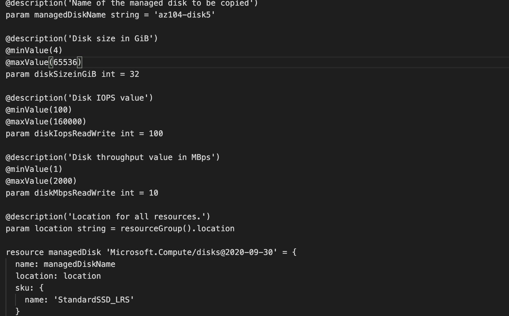
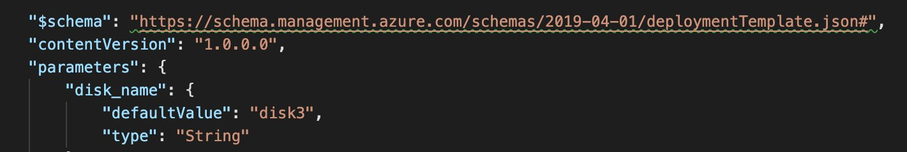
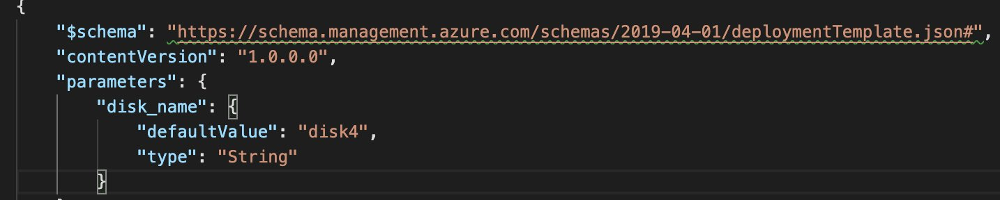
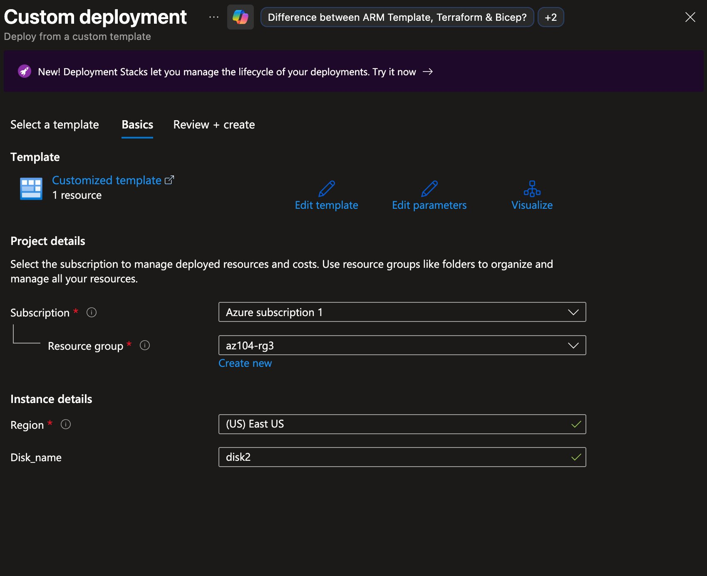

# AZ-104 Lab 03b — Manage Azure Resources Using ARM Templates

> **Azure Administrator Certification Lab Documentation**  
> Deploying Azure managed disks five different ways — using an auto-exported ARM template from the Portal, a simplified custom ARM template, Azure PowerShell, Azure CLI, and a Bicep template — to build fluency across all major Infrastructure-as-Code deployment methods.  
> ***Link to Lab Instructions:*** [GitHub Repo](https://github.com/MicrosoftLearning/AZ-104-MicrosoftAzureAdministrator/blob/master/Instructions/Labs/LAB_03b-Manage_Azure_Resources_by_Using_ARM_Templates.md)

---

## Table of Contents

1. [Lab Overview](#lab-overview)
2. [Environment Details](#environment-details)
3. [Folder Structure](#folder-structure)
4. [Step 1 — Create disk1 via Portal and Export ARM Template](#step-1--create-disk1-via-portal-and-export-arm-template)
5. [Step 2 — Redeploy Using Custom ARM Template via Portal (disk2)](#step-2--redeploy-using-custom-arm-template-via-portal-disk2)
6. [Step 3 — Deploy disk3 via Azure PowerShell](#step-3--deploy-disk3-via-azure-powershell)
7. [Step 4 — Deploy disk4 via Azure CLI](#step-4--deploy-disk4-via-azure-cli)
8. [Step 5 — Deploy disk5 via Bicep Template](#step-5--deploy-disk5-via-bicep-template)
9. [Validate All Disks](#validate-all-disks)
10. [Key Learnings](#key-learnings)
11. [Overall Result](#overall-result)

---

## Lab Overview

This lab explores **Infrastructure-as-Code (IaC)** on Azure by deploying the same managed disk resource five different ways, each using a different method or toolchain. The goal is to understand how ARM templates are structured, how parameters make them reusable, and how ARM JSON compares to Bicep as a more developer-friendly alternative.

Tasks completed:

- Created a managed disk via the Azure Portal and exported its auto-generated ARM template
- Modified the template to make the disk name a parameter and redeployed via Custom Deployment
- Redeployed using the same template via Azure PowerShell in Cloud Shell
- Redeployed using Azure CLI in Cloud Shell
- Rewrote the deployment as a Bicep template and deployed via Azure CLI

> **Core Concepts Applied:** ARM template structure, parameterization, Infrastructure-as-Code, multi-tool deployment fluency (Portal, PowerShell, CLI, Bicep).

---

## Environment Details

| Setting | Value |
|---|---|
| **Resource Group** | `az104-rg3` |
| **Location** | East US |
| **Disk Size** | 32 GiB |
| **Base SKU** | Standard_LRS |
| **Bicep SKU** | StandardSSD_LRS |
| **Disks Created** | `disk1`, `disk2`, `disk3`, `disk4`, `az104-disk5` |

---

## Folder Structure

```
az104-lab03b-arm-templates/
├── README.md
├── templates/
│   ├── template.json          # Original auto-exported ARM template (disk1)
│   ├── new-template.json      # Simplified ARM template with disk_name parameter (disk2/3/4)
│   └── azuredeploydisk.bicep  # Bicep template (disk5)
└── docs/
    ├── 01-disk1.png           # Bicep template code
    ├── 02-disk3.png           # new-template.json modified for disk3
    ├── 03-disk4.png           # new-template.json modified for disk4
    └── 04-disk5.png           # Custom deployment portal showing disk2 parameter
```

---

## Step 1 — Create disk1 via Portal and Export ARM Template

`disk1` was created through the Azure Portal UI. After creation, the **Export Template** feature was used to capture the auto-generated ARM template that represents the disk's configuration as code.

The exported template (`template.json`) uses a verbose parameter structure with a separate parameters file, and the disk name is exposed as a parameter `disks_disk1_name`.

**Key fields from `template.json`:**

| Field | Value |
|---|---|
| **Disk Name Parameter** | `disks_disk1_name` (default: `disk1`) |
| **Location** | `eastus` (hardcoded) |
| **SKU** | `Standard_LRS` |
| **Size** | 32 GiB |
| **Create Option** | Empty |
| **Encryption** | EncryptionAtRestWithPlatformKey |

> This exported template is the starting point. The Portal generates it automatically — the next step is simplifying and parameterizing it for reuse.

---

## Step 2 — Redeploy Using Custom ARM Template via Portal (disk2)

The exported template was simplified into `new-template.json` — removing the verbose parameters file structure and replacing it with a single clean `disk_name` parameter with a default value. This makes the template reusable for any disk name at deploy time.

**Key change from `template.json` → `new-template.json`:**

| | template.json | new-template.json |
|---|---|---|
| **Parameter name** | `disks_disk1_name` | `disk_name` |
| **Default value** | `disk1` | `disk2` |
| **Schema version** | 2015-01-01 | 2019-04-01 |

The template was deployed via **Azure Portal → Custom Deployment → Edit Template**, pasting in the new JSON. The portal surfaced `disk_name` as an editable field at deploy time.



---

## Step 3 — Deploy disk3 via Azure PowerShell

The same `new-template.json` was reused with the default value changed to `disk3`, then deployed from Azure Cloud Shell using PowerShell.

**Template modification — disk_name defaultValue set to `disk3`:**



```powershell
New-AzResourceGroupDeployment -ResourceGroupName az104-rg3 -TemplateFile new-template.json
```

**Result:** `disk3` provisioned successfully in `az104-rg3`.

---

## Step 4 — Deploy disk4 via Azure CLI

The same template was updated again to `disk4` and deployed using the Azure CLI from Cloud Shell — demonstrating the same IaC template being reused across different toolchains.

**Template modification — disk_name defaultValue set to `disk4`:**



```bash
az deployment group create --resource-group az104-rg3 --template-file new-template.json
```

**Result:** `disk4` provisioned successfully in `az104-rg3`.

Confirmed all four disks present:

```
az disk list --resource-group az104-rg3 --output table

Name    ResourceGroup    Location    Sku           SizeGb    ProvisioningState
------  ---------------  ----------  ------------  --------  -------------------
disk1   az104-rg3        eastus      Standard_LRS  32        Succeeded
disk2   az104-rg3        eastus      Standard_LRS  32        Succeeded
disk3   az104-rg3        eastus      Standard_LRS  32        Succeeded
disk4   az104-rg3        eastus      Standard_LRS  32        Succeeded
```

---

## Step 5 — Deploy disk5 via Bicep Template

The final disk was deployed using a **Bicep template** (`azuredeploydisk.bicep`) — Azure's domain-specific language that compiles down to ARM JSON but is significantly more readable and concise. Unlike the previous JSON templates, this one deploys a `StandardSSD_LRS` disk named `az104-disk5`.

**Bicep template — key parameters:**



| Parameter | Value |
|---|---|
| **managedDiskName** | `az104-disk5` |
| **diskSizeinGiB** | 32 (range: 4–65536) |
| **diskIopsReadWrite** | 100 (range: 100–160000) |
| **diskMbpsReadWrite** | 10 (range: 1–2000) |
| **location** | Inherited from resource group |
| **SKU** | `StandardSSD_LRS` |

```bash
az deployment group create --resource-group az104-rg3 --template-file azuredeploydisk.bicep
```

**Result:** `az104-disk5` provisioned as `StandardSSD_LRS`.

---

## Validate All Disks

Final state confirmed with all five disks present:

```
az disk list --resource-group az104-rg3 --output table

Name         ResourceGroup    Location    Sku              SizeGb    ProvisioningState
-----------  ---------------  ----------  ---------------  --------  -------------------
az104-disk5  az104-rg3        eastus      StandardSSD_LRS  32        Succeeded
disk1        az104-rg3        eastus      Standard_LRS     32        Succeeded
disk2        az104-rg3        eastus      Standard_LRS     32        Succeeded
disk3        az104-rg3        eastus      Standard_LRS     32        Succeeded
disk4        az104-rg3        eastus      Standard_LRS     32        Succeeded
```

Also confirmed via PowerShell:

```
Get-AzDisk | ft Name,ResourceGroupName,Location,DiskSizeGb,ProvisioningState

Name  ResourceGroupName  Location  DiskSizeGB  ProvisioningState
----  -----------------  --------  ----------  -----------------
disk1 AZ104-RG3          eastus    32          Succeeded
disk2 AZ104-RG3          eastus    32          Succeeded
disk3 AZ104-RG3          eastus    32          Succeeded
```

---

## Key Learnings

### 1. Exported ARM Templates Are a Great Starting Point
The Portal's Export Template feature generates a working ARM template from any existing resource. It's verbose but accurate — a solid baseline to simplify and parameterize for reuse.

### 2. Parameterization Is What Makes Templates Reusable
The key improvement from `template.json` to `new-template.json` was replacing the hardcoded disk name with a `disk_name` parameter. The same file then deployed disk2, disk3, and disk4 by simply changing one default value.

### 3. ARM JSON and Azure CLI / PowerShell Use the Same Templates
The same `new-template.json` file deployed successfully via Portal Custom Deployment, PowerShell (`New-AzResourceGroupDeployment`), and Azure CLI (`az deployment group create`) without modification. The toolchain is interchangeable.

### 4. Bicep Is More Readable Than ARM JSON
Bicep achieves the same result as ARM JSON with significantly less boilerplate. Decorators like `@description`, `@minValue`, and `@maxValue` make parameters self-documenting. Bicep compiles to ARM JSON at deploy time — it is not a separate system.

### 5. Each Deployment Method Has Its Place
The Portal is good for one-off deployments and exploration. PowerShell fits Windows-centric or scripted automation workflows. Azure CLI is preferred in Linux/bash environments. Bicep is the modern standard for maintainable IaC at scale.

---

## Overall Result

This lab demonstrated deploying the same resource five ways using progressively more code-driven approaches:

```
Portal UI → Export Template (disk1)
        ↓
Simplify Template + Custom Deployment Portal (disk2)
        ↓
Same Template → Azure PowerShell (disk3)
        ↓
Same Template → Azure CLI (disk4)
        ↓
Bicep Template → Azure CLI (az104-disk5)
        ↓
All 5 Disks Validated via CLI and PowerShell
```

**All objectives completed. Five disks deployed using five different methods.**

---

*Lab completed as part of AZ-104: Microsoft Azure Administrator certification preparation.*
