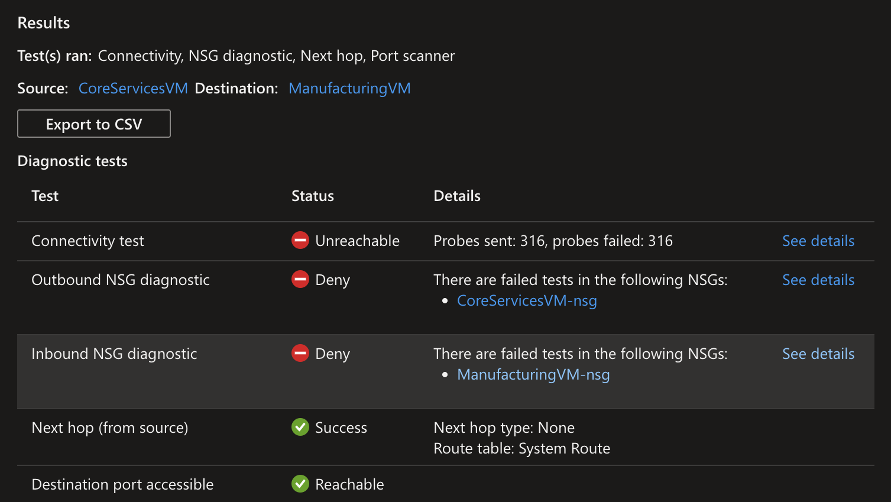

# AZ-104 Lab 05 — Implement Intersite Connectivity

> **Azure Administrator Certification Lab Documentation**  
> Configuring connectivity between segmented virtual networks using VNet peering, validating communication with Network Watcher and PowerShell, and implementing a custom route table for traffic control.  
> ***Link to Lab Instructions:*** [GitHub Repo](https://github.com/MicrosoftLearning/AZ-104-MicrosoftAzureAdministrator/blob/master/Instructions/Labs/LAB_05-Implement_Intersite_Connectivity.md)

---

## Table of Contents

1. [Lab Overview](#lab-overview)
2. [Environment Details](#environment-details)
3. [Architecture](#architecture)
4. [Step 1 — Deploy CoreServicesVM and CoreServicesVnet](#step-1--deploy-coreservicesvm-and-coreservicesvnet)
5. [Step 2 — Deploy ManufacturingVM and ManufacturingVnet](#step-2--deploy-manufacturingvm-and-manufacturingvnet)
6. [Step 3 — Test Connectivity Before Peering (Network Watcher)](#step-3--test-connectivity-before-peering-network-watcher)
7. [Step 4 — Configure VNet Peering](#step-4--configure-vnet-peering)
8. [Step 5 — Test Connectivity After Peering (PowerShell)](#step-5--test-connectivity-after-peering-powershell)
9. [Step 6 — Create a Custom Route](#step-6--create-a-custom-route)
10. [Cleanup](#cleanup)
11. [Key Learnings](#key-learnings)
12. [Overall Result](#overall-result)

---

## Lab Overview

This lab simulates a common enterprise scenario — two business units (Core Services and Manufacturing) running in separate virtual networks that need to communicate. By default, resources in different VNets cannot reach each other. This lab walks through establishing that connectivity via VNet peering and then layering in traffic control using a user-defined route.

Tasks completed:

- Deployed two Windows Server VMs each in their own VNet with non-overlapping address spaces
- Used Network Watcher Connection Troubleshoot to confirm no connectivity before peering
- Configured bidirectional VNet peering between CoreServicesVnet and ManufacturingVnet
- Validated connectivity post-peering using PowerShell `Test-NetConnection` from ManufacturingVM
- Created a perimeter subnet, route table, and custom route to simulate NVA traffic steering

> **Core Concepts Applied:** VNet peering, network segmentation, Network Watcher diagnostics, user-defined routes, and traffic steering via virtual appliance next hop.

---

## Environment Details

| Setting | Value |
|---|---|
| **Resource Group** | `az104-rg5` |
| **Location** | East US |
| **VM 1** | `CoreServicesVM` — private IP `10.0.0.4` |
| **VNet 1** | `CoreServicesVnet` — `10.0.0.0/16` |
| **Subnet 1** | `Core` — `10.0.0.0/24` |
| **VM 2** | `ManufacturingVM` — private IP `172.16.0.4` |
| **VNet 2** | `ManufacturingVnet` — `172.16.0.0/16` |
| **Subnet 2** | `Manufacturing` — `172.16.0.0/24` |
| **VM Size** | Standard_DS2_v3 |
| **OS** | Windows Server 2025 Datacenter Gen2 |
| **Admin Username** | `localadmin` |

---

## Architecture

```
CoreServicesVnet (10.0.0.0/16)          ManufacturingVnet (172.16.0.0/16)
├── Core subnet (10.0.0.0/24)           ├── Manufacturing subnet (172.16.0.0/24)
│   └── CoreServicesVM (10.0.0.4)       │   └── ManufacturingVM (172.16.0.4)
└── perimeter subnet (10.0.1.0/24)      │
    └── Future NVA (10.0.1.7)           │
                │                       │
                └──── VNet Peering ─────┘

Route Table: rt-CoreServices
  Route: PerimetertoCore
    Destination: 10.0.0.0/16
    Next Hop: Virtual Appliance (10.0.1.7)
    Associated to: Core subnet
```

---

## Step 1 — Deploy CoreServicesVM and CoreServicesVnet

`CoreServicesVM` was deployed via the Azure Portal with a new virtual network created inline during the VM creation wizard.

| Setting | Value |
|---|---|
| **VM Name** | `CoreServicesVM` |
| **Resource Group** | `az104-rg5` |
| **Image** | Windows Server 2025 Datacenter Gen2 |
| **Size** | Standard_DS2_v3 |
| **Public Inbound Ports** | None |
| **VNet Name** | `CoreServicesVnet` |
| **Address Range** | `10.0.0.0/16` |
| **Subnet** | `Core` — `10.0.0.0/24` |
| **Boot Diagnostics** | Disabled |

---

## Step 2 — Deploy ManufacturingVM and ManufacturingVnet

`ManufacturingVM` was deployed into a separate VNet with a completely different address space to simulate network segmentation between business units.

| Setting | Value |
|---|---|
| **VM Name** | `ManufacturingVM` |
| **Resource Group** | `az104-rg5` |
| **Image** | Windows Server 2025 Datacenter Gen2 |
| **Size** | Standard_DS2_v3 |
| **Public Inbound Ports** | None |
| **VNet Name** | `ManufacturingVnet` |
| **Address Range** | `172.16.0.0/16` |
| **Subnet** | `Manufacturing` — `172.16.0.0/24` |
| **Boot Diagnostics** | Disabled |

> The two VNets use non-overlapping address spaces (`10.0.0.0/16` and `172.16.0.0/16`) — a hard requirement for VNet peering. Overlapping CIDRs cannot be peered.

---

## Step 3 — Test Connectivity Before Peering (Network Watcher)

Before configuring peering, Network Watcher Connection Troubleshoot was used to confirm that the two VMs could not reach each other — validating that Azure's default behavior correctly isolates separate virtual networks.

**Connection Troubleshoot configuration:**

| Field | Value |
|---|---|
| **Source** | `CoreServicesVM` |
| **Destination** | `ManufacturingVM` |
| **Protocol** | TCP |
| **Destination Port** | 3389 |

**Result: All tests failed — connectivity correctly blocked before peering.**



| Diagnostic Test | Status | Detail |
|---|---|---|
| Connectivity test | Unreachable | 316 probes sent, 316 failed |
| Outbound NSG diagnostic | Deny | Failed on `CoreServicesVM-nsg` |
| Inbound NSG diagnostic | Deny | Failed on `ManufacturingVM-nsg` |
| Next hop (from source) | Success | Next hop type: None — no route to destination |
| Destination port accessible | Reachable | Port itself is open — blocked at network layer |

The "Next hop: None" result is the key finding — Azure has no route between the two VNets, confirming they are fully isolated before peering is established.

---

## Step 4 — Configure VNet Peering

Bidirectional VNet peering was configured from `CoreServicesVnet`. Azure creates both peering links in a single operation — one on each side.

**Peering configuration:**

| Setting | Value |
|---|---|
| **Peering link (CoreServices → Manufacturing)** | `CoreServicesVnet-to-ManufacturingVnet` |
| **Peering link (Manufacturing → CoreServices)** | `ManufacturingVnet-to-CoreServicesVnet` |
| **Remote VNet** | `ManufacturingVnet (az104-rg5)` |
| **Allow forwarded traffic** | Enabled (both directions) |
| **Peering status** | Connected |

After adding the peering, both VNets showed **Peering status: Connected** after a page refresh — confirming the peering was established successfully in both directions.

---

## Step 5 — Test Connectivity After Peering (PowerShell)

With peering established, `Test-NetConnection` was run from `ManufacturingVM` targeting the private IP of `CoreServicesVM` using the Run Command feature in the Azure Portal (no public IP or RDP required).

```powershell
Test-NetConnection 10.0.0.4 -port 3389
```

**Output:**

```
ComputerName     : 10.0.0.4
RemoteAddress    : 10.0.0.4
RemotePort       : 3389
InterfaceAlias   : Ethernet
SourceAddress    : 172.16.0.4
TcpTestSucceeded : True
```

**Result: TcpTestSucceeded: True — connectivity confirmed across peered VNets.**

The source address `172.16.0.4` (ManufacturingVM) successfully reached `10.0.0.4` (CoreServicesVM) across VNet boundaries using Azure's backbone infrastructure — no public internet involved.

---

## Step 6 — Create a Custom Route

A custom route was created to simulate traffic steering through a future Network Virtual Appliance (NVA) in a perimeter subnet. This demonstrates how user-defined routes (UDRs) override Azure's default system routes.

### Add Perimeter Subnet to CoreServicesVnet

```
CoreServicesVnet → Subnets → + Subnet
Name: perimeter
Address range: 10.0.1.0/24
```

### Create Route Table

| Setting | Value |
|---|---|
| **Name** | `rt-CoreServices` |
| **Resource Group** | `az104-rg5` |
| **Region** | East US |
| **Propagate gateway routes** | No |

### Add Custom Route

| Setting | Value |
|---|---|
| **Route Name** | `PerimetertoCore` |
| **Destination Type** | IP Addresses |
| **Destination** | `10.0.0.0/16` (CoreServicesVnet) |
| **Next Hop Type** | Virtual Appliance |
| **Next Hop Address** | `10.0.1.7` (future NVA) |

### Associate Route Table to Subnet

| Setting | Value |
|---|---|
| **Virtual Network** | `CoreServicesVnet` |
| **Subnet** | `Core` |

Any traffic from the `Core` subnet destined for `10.0.0.0/16` will now be routed through `10.0.1.7` (the NVA) instead of using Azure's default system route. This is the standard pattern for hub-and-spoke architectures where all traffic flows through a central inspection point.

---

## Cleanup

```powershell
Remove-AzResourceGroup -Name "az104-rg5"
```

---

## Key Learnings

### 1. VNets Are Isolated by Default
Resources in different virtual networks cannot communicate without explicit configuration. This is Azure's secure-by-default posture — no implicit trust between network segments.

### 2. VNet Peering Enables Low-Latency Cross-VNet Communication
Peered VNets communicate over Azure's private backbone infrastructure — not the public internet. Traffic is fast, private, and does not require gateways or VPNs for same-region peering.

### 3. Peering Address Spaces Cannot Overlap
Both VNets must have non-overlapping CIDR blocks. Planning IP address space carefully before deployment is critical — peering cannot be applied retroactively to overlapping networks.

### 4. Network Watcher Is the Right First Diagnostic Tool
Connection Troubleshoot runs multiple diagnostics simultaneously — connectivity, NSG rules, next hop, and port accessibility — and surfaces the exact failure point. The "Next hop: None" result before peering clearly identified the missing route as the root cause.

### 5. User-Defined Routes Override System Routes
Azure automatically creates system routes for each subnet. UDRs let you override these to steer traffic through NVAs, firewalls, or inspection appliances — the foundation of hub-and-spoke and zero-trust network architectures.

---

## Overall Result

```
Deploy CoreServicesVM (10.0.0.0/16) + ManufacturingVM (172.16.0.0/16)
        ↓
Network Watcher → Unreachable (316/316 probes failed) — isolation confirmed
        ↓
Configure Bidirectional VNet Peering → Status: Connected
        ↓
Test-NetConnection 10.0.0.4 -port 3389 → TcpTestSucceeded: True
        ↓
Add Perimeter Subnet + Route Table → Traffic steered via Virtual Appliance
```

**All objectives completed. VNet isolation confirmed, peering validated, and custom routing configured.**

---

*Lab completed as part of AZ-104: Microsoft Azure Administrator certification preparation.*
