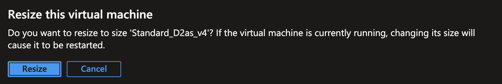
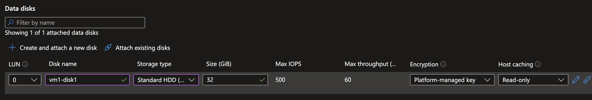
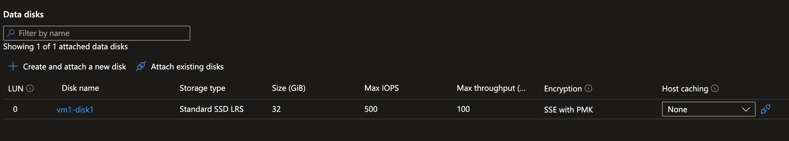

# AZ-104 Lab 08 — Manage Virtual Machines

> **Azure Administrator Certification Lab Documentation**  
> Deploying and managing Azure Virtual Machines — including resizing, disk management, and Virtual Machine Scale Sets with autoscaling — executed via the Azure Portal and PowerShell.  
> ***Link to Lab Instructions:*** [GitHub Repo](https://github.com/MicrosoftLearning/AZ-104-MicrosoftAzureAdministrator/blob/master/Instructions/Labs/LAB_08-Manage_Virtual_Machines.md)

---

## Table of Contents

1. [Lab Overview](#lab-overview)
2. [Environment Details](#environment-details)
3. [Part 1 — Deploy and Manage Virtual Machines](#part-1--deploy-and-manage-virtual-machines)
   - [Step 1 — Deploy Two Virtual Machines](#step-1--deploy-two-virtual-machines)
   - [Step 2 — Resize a Virtual Machine](#step-2--resize-a-virtual-machine)
   - [Step 3 — Add and Manage a Data Disk](#step-3--add-and-manage-a-data-disk)
   - [Step 4 — Delete the Virtual Machines](#step-4--delete-the-virtual-machines)
4. [Part 2 — Virtual Machine Scale Sets](#part-2--virtual-machine-scale-sets)
   - [Step 5 — Deploy a VM Scale Set](#step-5--deploy-a-vm-scale-set)
   - [Step 6 — Configure Autoscale Rules](#step-6--configure-autoscale-rules)
   - [Step 7 — Cleanup](#step-7--cleanup)
5. [Key Learnings](#key-learnings)
6. [Overall Result](#overall-result)

---

## Lab Overview

This lab covers the full lifecycle of Azure Virtual Machines and Virtual Machine Scale Sets. The first part focuses on deploying individual VMs, modifying their configuration post-deployment, and managing data disks. The second part covers deploying a scale set with a load balancer and configuring CPU-based autoscale rules.

Tasks completed:

- Deployed two Windows Server VMs into an existing resource group
- Resized a VM after initial deployment
- Created, detached, upgraded, reattached, and deleted a managed data disk
- Deleted VMs via PowerShell
- Deployed a Virtual Machine Scale Set with load balancing across availability zones
- Configured autoscale rules to scale out and in based on CPU utilization
- Cleaned up all resources via PowerShell

> **Core Concepts Applied:** VM lifecycle management, disk operations, scale set orchestration, and metric-driven autoscaling.

---

## Environment Details

| Setting | Value |
|---|---|
| **Resource Group (VMs)** | `Staging_VMs` |
| **Resource Group (VMSS)** | `az104-rg8` |
| **Location** | Central US |
| **VM Names** | `az104-vm-1`, `az104-vm-2` |
| **VM Size (Initial)** | Standard_D2s_v3 (2 vCPUs, 8 GiB) |
| **VM Size (After Resize)** | Standard_D2as_v4 |
| **OS Image** | Windows Server 2025 Datacenter Gen2 |
| **Admin Username** | `localadmin` |
| **Scale Set Name** | `vmss1` |
| **Scale Set Instance Count** | 2 (min), 10 (max) |

---

## Part 1 — Deploy and Manage Virtual Machines

### Step 1 — Deploy Two Virtual Machines

Two Windows Server VMs were deployed into the `Staging_VMs` resource group via the Azure Portal with the following key configuration:

| Setting | Value |
|---|---|
| **VM Names** | `az104-vm-1`, `az104-vm-2` |
| **Region** | Central US |
| **Availability Zone** | Zone 1 |
| **Image** | Windows Server 2025 Datacenter Gen2 |
| **Size** | Standard_D2s_v3 (2 vCPUs, 8 GiB) |
| **OS Disk Type** | Premium SSD LRS |
| **OS Disk Delete Option** | Delete with VM |
| **NIC Delete Option** | Delete with VM |
| **Disk Controller** | SCSI |

Setting the disk and NIC delete options to **Delete with VM** ensures no orphaned resources remain after a VM is removed — an important cost and hygiene practice.

---

### Step 2 — Resize a Virtual Machine

After deployment, `az104-vm-1` was resized from `Standard_D2s_v3` to `Standard_D2as_v4` through the Azure Portal. Azure prompts a confirmation warning that resizing a running VM will cause a restart.



**Key point:** Not all VM sizes are available in every region or availability zone. Azure surfaces only compatible sizes during the resize operation. The VM must restart to apply the change.

---

### Step 3 — Add and Manage a Data Disk

A managed data disk named `vm1-disk1` was created and attached to `az104-vm-1`. The following sequence of operations was then performed:

1. **Attached** `vm1-disk1` as Standard HDD LRS (32 GiB, LUN 0)
2. **Detached** the disk from the VM
3. **Upgraded** the disk storage type to Standard SSD LRS while detached
4. **Reattached** the upgraded disk to the VM

**Before upgrade — disk attached as Standard HDD:**



**After upgrade — disk reattached as Standard SSD LRS:**



**Key point:** Managed disk SKUs can only be changed while the disk is **detached** from a VM. This is a non-destructive operation — data is preserved through the upgrade — and the disk can be immediately reattached afterward.

---

### Step 4 — Delete the Virtual Machines

Both VMs were deleted via PowerShell:

```powershell
Remove-AzVM -ResourceGroupName "crc-frontend-rg" -Name "az104-vm-1"
Remove-AzVM -ResourceGroupName "crc-frontend-rg" -Name "az104-vm-2"
```

Because the disks and NICs were configured with the **Delete** option at deployment, they were automatically removed along with the VMs — leaving no orphaned resources behind.

---

## Part 2 — Virtual Machine Scale Sets

### Step 5 — Deploy a VM Scale Set

A Virtual Machine Scale Set was deployed via the Azure Portal with the following configuration:

| Setting | Value |
|---|---|
| **Name** | `vmss1` |
| **Resource Group** | `az104-rg8` (new) |
| **Region** | Central US |
| **Orchestration Mode** | Uniform |
| **Availability Zones** | 1, 2, 3 |
| **Image** | Windows Server 2025 Datacenter Gen2 |
| **Size** | Standard_D2s_v3 (2 vCPUs, 8 GiB) |
| **Initial Instance Count** | 2 |
| **OS Disk Type** | Premium SSD LRS |
| **Virtual Network** | `vmss-vnet` (new) — subnet0 (10.82.0.0/20) |
| **Load Balancing** | Yes |
| **Upgrade Mode** | Manual |
| **Overprovisioning** | Off |
| **Scale Beyond 100 Instances** | Yes |

Deploying across **all three availability zones** ensures the scale set can survive a single zone failure while continuing to serve traffic through the load balancer.

---

### Step 6 — Configure Autoscale Rules

Autoscale was configured on `vmss1` to dynamically adjust instance count based on CPU utilization:

| Setting | Value |
|---|---|
| **Minimum Instances** | 2 |
| **Maximum Instances** | 10 |
| **Default Instances** | 2 |
| **Metric** | Percentage CPU |
| **Evaluation Window** | 10 minutes |
| **Granularity** | 1 minute |
| **Cooldown Period** | 5 minutes (after each scale event) |

**Scale-out rule:** When average CPU exceeds **70%** over 10 minutes → increase instance count by **50%**

**Scale-in rule:** When average CPU drops below **30%** over 10 minutes → decrease instance count by **50%**

The **5-minute cooldown** between scale actions prevents thrashing — the scale set waits after each scaling event before evaluating again. The **50% increment** means the scale set adds or removes instances proportionally rather than by a fixed count, which handles traffic spikes more smoothly.

---

### Step 7 — Cleanup

The entire scale set resource group was deleted via PowerShell, removing all associated resources including the VMSS, virtual network, and load balancer:

```powershell
Remove-AzResourceGroup -Name "az104-rg8"
```

---

## Key Learnings

### 1. VM Sizing Is Flexible Post-Deployment
VMs can be resized after initial deployment without being redeployed. Azure filters available sizes to only those compatible with the current region and zone, and applies the change on restart.

### 2. Disk SKU Upgrades Require Detachment
A managed disk's storage tier can only be changed while it is detached from a VM. This is non-destructive — data is preserved — and the disk can be reattached immediately after the upgrade.

### 3. Delete Options Prevent Orphaned Resources
Configuring disks and NICs to delete alongside the VM at provisioning time is a best practice. Without this, deleted VMs leave behind orphaned resources that continue incurring costs.

### 4. Scale Sets Distribute Load Across Zones
Deploying a VMSS across all three availability zones ensures high availability. If one zone goes down, the load balancer routes traffic to instances in the remaining zones automatically.

### 5. Autoscale Cooldowns Prevent Thrashing
Without a cooldown period, a scale set could continuously add and remove instances in response to momentary CPU spikes. The 5-minute cooldown enforces a stabilization window between scaling events.

### 6. Uniform Orchestration Mode Is Best for Identical Workloads
Uniform mode manages all instances as identical copies, making it well-suited for stateless workloads behind a load balancer. Flexible mode is used when instances need individual configurations.

---

## Overall Result

This lab demonstrated the full VM and VMSS management lifecycle in Azure:

```
Deploy VMs with Correct Delete Options
        ↓
Resize VM Post-Deployment → Confirmed Restart Behavior
        ↓
Attach Disk → Detach → Upgrade SKU → Reattach
        ↓
Delete VMs via PowerShell → No Orphaned Resources
        ↓
Deploy VMSS Across 3 Availability Zones with Load Balancer
        ↓
Configure CPU-Based Autoscale → Scale Out at 70%, In at 30%
        ↓
Clean Up Resource Group via PowerShell
```

**All objectives completed. VM lifecycle and scale set autoscaling validated.**

---

*Lab completed as part of AZ-104: Microsoft Azure Administrator certification preparation.*
