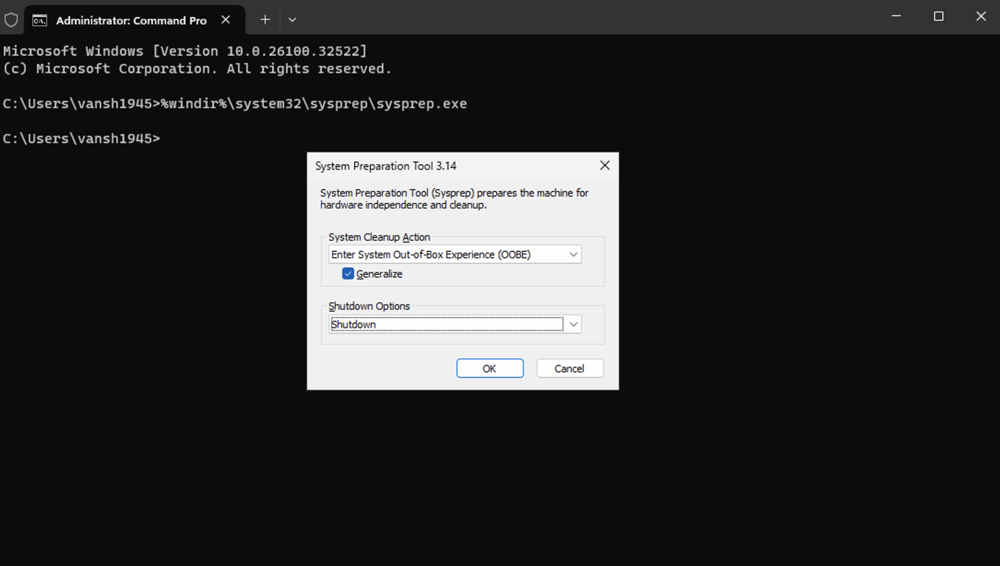
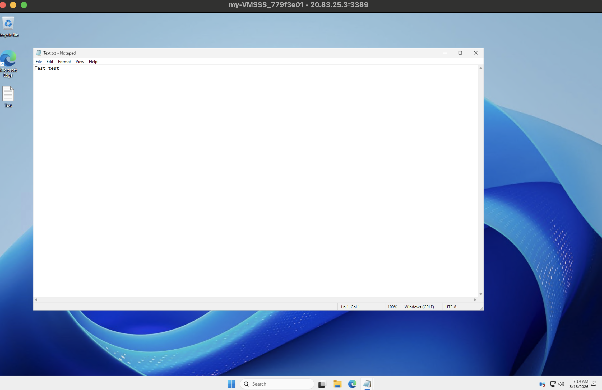

# Lab — Setting Up a Virtual Machine Scale Set from a Custom Image

> **Azure Administrator Lab Documentation**  
> Creating a generalized VM image using Sysprep, deploying a Virtual Machine Scale Set from that custom image, configuring RDP access via NSG inbound rules, and validating image fidelity by connecting to a scale set instance.  


---

## Table of Contents

1. [Lab Overview](#lab-overview)
2. [Environment Details](#environment-details)
3. [Step 1 — Create Resource Group via PowerShell](#step-1--create-resource-group-via-powershell)
4. [Step 2 — Deploy a Base Virtual Machine](#step-2--deploy-a-base-virtual-machine)
5. [Step 3 — Create a Test File and Generalize with Sysprep](#step-3--create-a-test-file-and-generalize-with-sysprep)
6. [Step 4 — Capture the VM as a Custom Image](#step-4--capture-the-vm-as-a-custom-image)
7. [Step 5 — Deploy the VM Scale Set from Custom Image](#step-5--deploy-the-vm-scale-set-from-custom-image)
8. [Step 6 — Configure NSG Inbound Rule for RDP](#step-6--configure-nsg-inbound-rule-for-rdp)
9. [Step 7 — Connect via RDP and Validate Image Fidelity](#step-7--connect-via-rdp-and-validate-image-fidelity)
10. [Step 8 — Cleanup](#step-8--cleanup)
11. [Key Learnings](#key-learnings)
12. [Overall Result](#overall-result)

---

## Lab Overview

This lab demonstrates how to build a Virtual Machine Scale Set from a **custom generalized image** rather than a marketplace image. The key distinction from a standard VMSS deployment is the Sysprep step — the base VM is configured, generalized, and captured as a reusable image that every scale set instance is then stamped from.

Tasks completed:

- Created a resource group via PowerShell
- Deployed a base Windows Server VM and placed a test file on it
- Generalized the VM using Sysprep (OOBE + Generalize + Shutdown)
- Captured the deallocated VM as a custom managed image
- Deployed a VMSS using that custom image across availability zones with a load balancer
- Opened RDP access via an NSG inbound rule
- Connected to a scale set instance via RDP and confirmed the test file persisted through imaging

> **Core Concepts Applied:** VM generalization, custom image capture, VMSS deployment from private image, NSG rule configuration, and image fidelity validation.

---

## Environment Details

| Setting | Value |
|---|---|
| **Resource Group (VMSS)** | `VMScale-Set-ResourceGroup` |
| **Resource Group (Base VM)** | `myvm_group` |
| **Location** | Central US |
| **Base VM Name** | `myvm` |
| **Scale Set Name** | `my-VMSSS` |
| **Custom Image Name** | `myvm-image` |
| **VM / VMSS Size** | Standard_D2s_v3 (2 vCPUs, 8 GiB) |
| **OS Image** | Windows Server 2025 Datacenter Gen2 |
| **Admin Username** | `vansh1945` |
| **Orchestration Mode** | Flexible |
| **Availability Zones** | 1, 2, 3 |
| **OS Disk Type** | Premium SSD LRS |

---

## Step 1 — Create Resource Group via PowerShell

The resource group for the scale set was created via PowerShell before any portal work began.

```powershell
New-AzResourceGroup -Name "VMScale-Set-ResourceGroup" -Location "Central US"
```

---

## Step 2 — Deploy a Base Virtual Machine

A base Windows Server VM named `myvm` was deployed into `myvm_group` via the Azure Portal. This VM serves purely as the golden image source — it is not kept running after imaging.

| Setting | Value |
|---|---|
| **VM Name** | `myvm` |
| **Resource Group** | `myvm_group` |
| **Image** | Windows Server 2025 Datacenter Gen2 |
| **Size** | Standard_D2s_v3 |
| **Admin Username** | `vansh1945` |
| **OS Disk Type** | Premium SSD LRS |
| **Availability Zones** | 1, 2, 3 |

---

## Step 3 — Create a Test File and Generalize with Sysprep

Before capturing the image, a test file (`Test.txt`) was created on the VM desktop to serve as a validation marker — if the file appears on scale set instances after deployment, the image was captured correctly.


The VM was then generalized using the Windows System Preparation Tool (Sysprep). Generalizing strips the machine-specific identity from the OS, making it suitable for use as a reusable image template.

```
%windir%\system32\sysprep\sysprep.exe
```

Settings used in the Sysprep dialog:

| Setting | Value |
|---|---|
| **System Cleanup Action** | Enter System Out-of-Box Experience (OOBE) |
| **Generalize** | Checked |
| **Shutdown Options** | Shutdown |



After clicking OK, the VM shut down automatically. Once deallocated, the VM is no longer usable — generalizing is a **destructive, irreversible** operation on that VM instance.

> **Important:** Never run Sysprep with Generalize on a VM you intend to keep. Generalize on a copy or a VM purpose-built for imaging.

---

## Step 4 — Capture the VM as a Custom Image

With the VM deallocated and generalized, it was captured as a managed image via the Azure Portal:

```
VM Overview → Capture → Create Image
```

| Setting | Value |
|---|---|
| **Image Name** | `myvm-image` |
| **Resource Group** | `myvm_group` |
| **Zone Resiliency** | Off |
| **Auto-delete VM after capture** | No |

The resulting image `myvm-image` was stored as a managed image resource and used as the source for the VMSS in the next step.

---

## Step 5 — Deploy the VM Scale Set from Custom Image

The VMSS was deployed using `myvm-image` as the OS source instead of a marketplace image. This ensures every instance in the scale set is stamped from the same golden configuration — including any files, settings, or software placed on the base VM before Sysprep.

| Setting | Value |
|---|---|
| **Scale Set Name** | `my-VMSSS` |
| **Resource Group** | `myvm_group` |
| **Location** | Central US |
| **Orchestration Mode** | Flexible |
| **Availability Zones** | 1, 2, 3 |
| **Image Source** | Custom — `myvm-image` |
| **Size** | Standard_D2s_v3 |
| **Instance Count** | 2 |
| **OS Disk Type** | Premium SSD LRS — Delete with VM |
| **NIC Delete Option** | Delete with VM |
| **Virtual Network** | `vnet-centralus` (existing) |
| **Subnet** | `default` |
| **Load Balancer** | `VMS-LB` with backend pool `bepool` |
| **Upgrade Mode** | Manual |
| **Boot Diagnostics** | Enabled |

---

## Step 6 — Configure NSG Inbound Rule for RDP

By default, all inbound internet traffic to the VMSS instances was blocked. An inbound NSG rule was added to allow RDP connections on port 3389.

| Setting | Value |
|---|---|
| **Rule Name** | `Port_3389` |
| **NSG** | `basicNsgvnet-centralus-nic01` |
| **Source** | Any |
| **Destination Port** | 3389 |
| **Protocol** | TCP |
| **Action** | Allow |
| **Priority** | 370 |

> **Note:** Allowing RDP from Any source is acceptable for a short-lived lab environment. In production, this rule should be scoped to specific IP ranges or replaced with Azure Bastion.

---

## Step 7 — Connect via RDP and Validate Image Fidelity

An RDP connection was established to one of the scale set instances using its public IP. Upon connecting, `Test.txt` was confirmed present on the desktop — verifying that the custom image was captured and deployed correctly.



The title bar of the RDP session (`my-VMSSS_779f3e01`) confirms the connection is to a scale set instance, not the original base VM.

---

## Step 8 — Cleanup

The resource group containing the scale set and all associated resources was deleted via the Azure Portal:

```
Resource Groups → VMScale-Set-ResourceGroup → Delete resource group
```

Type the resource group name to confirm, then click Delete. This removes the VMSS, load balancer, virtual network, public IP, and NSG in a single operation.

---

## Key Learnings

### 1. Sysprep Generalization Is Irreversible
Running Sysprep with Generalize permanently destroys the machine-specific identity of the VM. The VM cannot be started again after this — it can only be used as an image source. Always generalize a copy, not a production VM.

### 2. Custom Images Guarantee Consistent Instance Configuration
Every VMSS instance deployed from a captured image starts in exactly the same state — same OS configuration, same files, same software. This is essential for stateless workloads where instance uniformity is required.

### 3. Flexible Orchestration Mode Allows Per-Instance Management
Unlike Uniform mode (which treats all instances identically), Flexible mode allows individual VM instances within the scale set to be managed independently. This is useful when instances need different configurations or when integrating with other Azure services.

### 4. Load Balancer NAT Rules Enable Per-Instance RDP Access
In a VMSS with a load balancer, you cannot RDP directly to an instance IP. Instead, the load balancer exposes unique NAT rule ports (e.g. `:50001`, `:50002`) that map to each instance, allowing direct access without exposing each VM with its own public IP.

### 5. NSG Rules on Scale Sets Should Be Scoped
The `Port_3389` rule allowed RDP from any source, which is acceptable in a lab. In production environments, RDP access should be limited to trusted IP ranges or replaced entirely with Azure Bastion to avoid exposing management ports to the internet.

---

## Overall Result

This lab demonstrated building and deploying a VMSS from a custom generalized image:

```
Create Resource Group (PowerShell)
        ↓
Deploy Base VM → Create Test File
        ↓
Generalize with Sysprep → VM Deallocated
        ↓
Capture VM as Custom Managed Image
        ↓
Deploy VMSS from Custom Image Across 3 Zones
        ↓
Open RDP via NSG Inbound Rule
        ↓
Connect via RDP → Test File Confirmed → Image Fidelity Validated
```

**All objectives completed. Custom image captured and deployed successfully across scale set instances.**

---

*Lab completed as part of Azure Administrator (AZ-104) certification preparation.*
